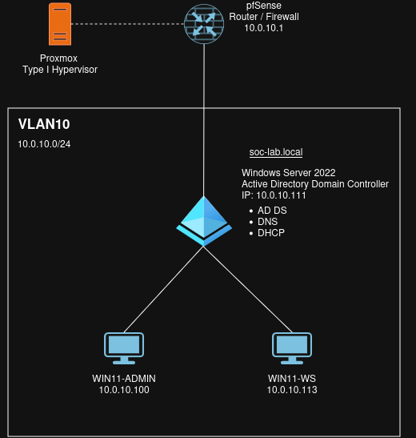

# Enterprise Support Lab

## Overview

A self-built enterprise lab environment designed to simulate real-world IT infrastructure and operations.  
It covers Windows Server administration, M365 administration, and IT service management.

Built on Proxmox, managed remotely via PowerShell and RSAT.

## Lab Diagram


This is the current iteration of the lab topology, updated as the environment evolves to reflect the current state.

## Environment Summary

| Hostname | IP | Role | OS |
|---|---|---|---|
| WinDC-01 | 10.0.10.111 | Active Directory Domain Controller | Windows Server 2022 |
| WIN11-ADMIN | 10.0.10.100 | Administrative Workstation | Windows 11 |
| WIN11-WS | 10.0.10.113 | Standard User Endpoint | Windows 11 |

## Repo Index

### [Enterprise AD Infrastructure](./enterprise-ad-infrastructure)

AD DS, DNS, DHCP, GPO, OU design, admin tier model.

```
├── enterprise-ad-infrastructure/
│   ├── README.md
│   ├── ad-structure/
│   ├── dns/
│   ├── dhcp/
│   ├── gpo/
│   ├── users-and-groups/
│   └── troubleshooting/
```

### [Microsoft 365 Administration](./m365-administration)

Entra ID, endpoint management.

```
├── m365-administration/
│   ├── README.md
│   └── entra/
```

### [IT Service Operations](./it-service-operations)

ServiceNow ITSM, ticketing workflows..

```
└── it-service-operations/
    ├── README.md
    └── ticketing-workflows/
```

## Design Principles

- Microsoft AD Tier Model reference
- Principle of Least Privilege
- GPOs Scoped to OUs
- Remote Management via PowerShell
- Documentation-first Approach

## Related Resources

[Active Directory Domain Services Tier Model](https://learn.microsoft.com/en-us/windows-server/identity/ad-ds/tier-model)  
[Active Directory Domain Services Tier Model Best Practices](https://microsoft.github.io/ActiveDirectoryTierModel/best-practices/)
